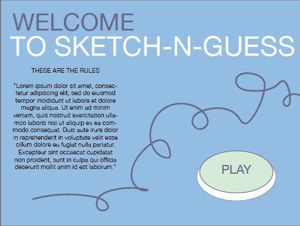

# Sketch-N-Guess

### Date 2/5/2021

#### By: Siobahn Schuck

[website](https://www.siobahnschuck.com) |
[vimeo](https://www.vimeo.com/siobahnschuck)
 | [linkedIn](https://www.linkedin.com/in/siobahn-schuck-989b22181/) |
[gitHub](https://github.com/siobahnschuck)

***
### ***Description***
Sketch-N-Guess is an browser based, two player game inspired by Pictionary. Each player has a turn drawing a representation of a random word to the best of their ability and then try to guess what it is their opponent has drawn. 

***
### ***Technologies***
* HTML 
* CSS 
* JavaScript
  * Webster's Dictionary API 

***
### ***Getting Started***

To view my Trello board click [here](https://trello.com/b/0e0sdKpX/sketch-n-guess)

To play, grab a friends and click [this link](http://www.mywebsite.net) to visit my website.

***
### ***Screenshots***

###### DESIGN 

*** 
### ***Future Updates***
- [ ] To play the same game on multiple devices 
- [ ] Online player Option 

*** 
### ***Credits***

Inspiration: [drawzie](https://www.drawize.com/)
API: [Merriam-Webster](https://dictionaryapi.com/)